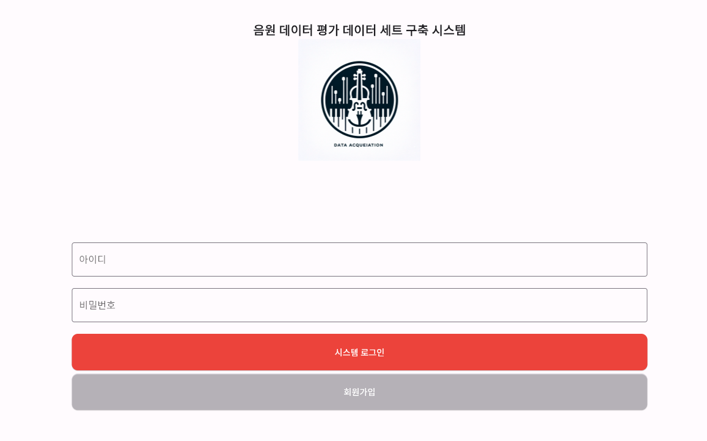
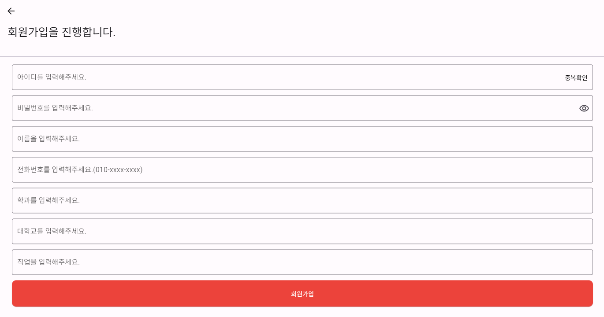

# [**피아노 데이터 평가 및 수집 프로그램**]

### 본 리포지토리는DGU DAlab의 피아노 데이터 평가 및 수집 프로그램 소스 코드 입니다.
---
---

## 기술 스택

- **Frontend**  
    

- **Backend**  
      

- **DevOps**  
      
---

## 서비스 소개

### [**기능 소개**]
- 본 서비스는 피아노 연주 데이터를 평가 받기 위해 업로드 및 관리
- 피아노 연주 데이터 재생 및 항목별 평가

---

## 주요 기능(상세)

- ### 회원가입 및 로그인


 처음 접속하면 위와 같은 **로그인 / 회원가입 화면**이 나타납니다.
 
  | 단계 | 설명 |
  |------|------|
  | **아이디·비밀번호 입력** | 초기 화면에서 아이디와 비밀번호를 입력합니다. |
  | **시스템 로그인 클릭** | 자격이 올바르면 홈(곡 목록) 화면으로 자동 이동합니다. |
  | **오류 메시지** | 잘못된 정보일 경우 “아이디 또는 비밀번호가 올바르지 않습니다” 경고가 바로 표시됩니다. |


- ### 회원가입


  | 입력 항목 | 필수 | 규칙 · 설명 | 예외 / 오류 메시지 |
  |-----------|------|-------------|--------------------|
  | **아이디** | ● | 영문·숫자 **3 자 이상** | `중복확인` 버튼 → 이미 존재하면 “사용 불가” |
  | **비밀번호** | ● | 8 자 이상, **동일 문자·패턴이 3회 이상 반복되면 안 됨** (ex. `aaa`, `123123123`) | 규칙 위반 시 붉은 테두리 + 안내 문구 |
  | 이름 | ○ | 실명 또는 닉네임 | 빈 칸 허용 |
  | **전화번호** | ● | `010-xxxx-xxxx` 형식 | 형식이 다르면 경고 표시 |
  | 학과 | ○ | 전공 / 소속 | 빈 칸 허용 |
  | 대학교 | ○ | 재학·졸업 학교 | 빈 칸 허용 |
  | 직업 | ○ | 학생, 연구원 등 | 빈 칸 허용 |

  1. **아이디**·**비밀번호**·**전화번호** 세 항목은 반드시 입력해야 하며 규칙을 통과해야 합니다.  
  2. 나머지 항목은 입력하지 않아도 회원가입이 가능합니다.  
  3. 모든 조건을 만족하고 **회원가입** 버튼을 누르면 “회원가입이 완료되었습니다” 알림 후 로그인 화면으로 이동합니다.  
  4. 입력 오류가 있으면 해당 입력란 아래에 즉시 안내 문구가 표시되므로 수정 후 다시 시도하면 됩니다.


- ### 음악 검색

- ### 10초 단위의 데이터 평가

- ### 곡 악보 표시 및 재생

- ### 15가지 항목을 기준으로 평가 지원
   - 톤, 레가토, 해석, 프레이징, 멜로디, 음악성(음악적표현력), 보이싱, 음정, 셈여림, 셈여림 변화, 템포, 템포의 변화, 음의 길이와 관련된 아티큘레이션, 리듬, 페달링

- 연주자 익명 평가 시스템

- SQL을 통해 평가결과 내보내기

---

## 서비스 아키텍처


---


## 설치 및 실행 방법

1. 저장소 클론

```bash
git clone https://github.com/dalabdgw/Piano_Performance_Evaluation_Application.git
```

2. 프로젝트 디렉터리로 이동

```bash
cd Piano_Performance_Evaluation_Application
```

3. 파이썬 개발 환경 설정
```bash
python -m venv venv
pip install -r requirements.txt
```

4. 다트 개발 환경 설정
Flutter 개발 환경이 설정되어 있지 않다면, [Flutter 설치 가이드](https://dart-ko.dev/)를 참고하여 설치하세요.

```bash
flutter pub get
```

5. 파이썬 플라스크 서버 실행

```bash
python main.py
```


---

## CI/CD 구축 및 배포 방법(추가 예정)

aws ec2를 통한 배포 및 서비스 제공

빌드 오류를 낮추기 위해서 사용
```bash
flutter clean
```
빌드 오류를 낮추기 위해서 사용


```bash
flutter pub get
```
패키지 적용

```bash
flutter build
```
빌드 파일 생성


```bash
cd ./build/web
```

```bash
move web ./backend/templates
```


```bash
cd ./backend/templates
```

```bash
git --version
```
깃허브 버전 확인
- 실행이 안된다면 깃허브 설치 후 시도

```bash
git --version
```

```bash
git add .
```

혹은

```bash
git add 파일명.확장자
```

```bash
git commit -m "[docs] 배포 버전 업로드"
```
커밋 메시지 작성 시

'[작업 카테고리] 작업한 내용' 으로 작성


```bash
git remore -v
```
업스트림 확인 후

origin  https://github.com/dalabdgw/Piano_Performance_Evaluation_Application.git (fetch)
origin  https://github.com/dalabdgw/Piano_Performance_Evaluation_Application.git (push) 

으로 출력되는 경우

```bash
git push origin main
```
만약 업스트림이 다음이 아닌 경우

```bash
git remote add origin https://github.com/dalabdgw/Piano_Performance_Evaluation_Application.git
```
을 사용해서 업스트림 적용 후 업로드 진행

---

 - aws 보안 설명 및 서버 로그인 하는 방법

aws 콘솔 접속
 key.pem
키를 활용해서 윈도우 암호 획득

---
