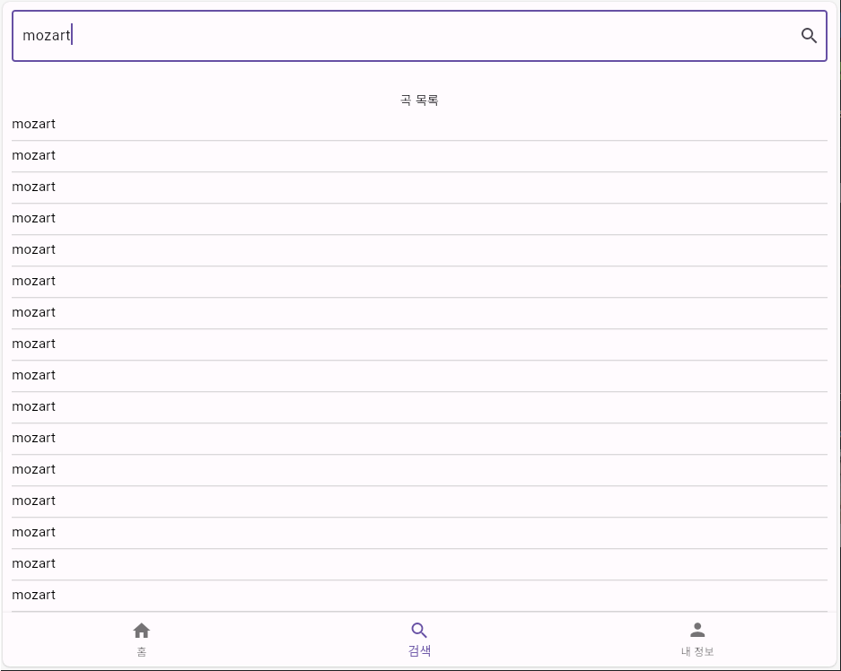
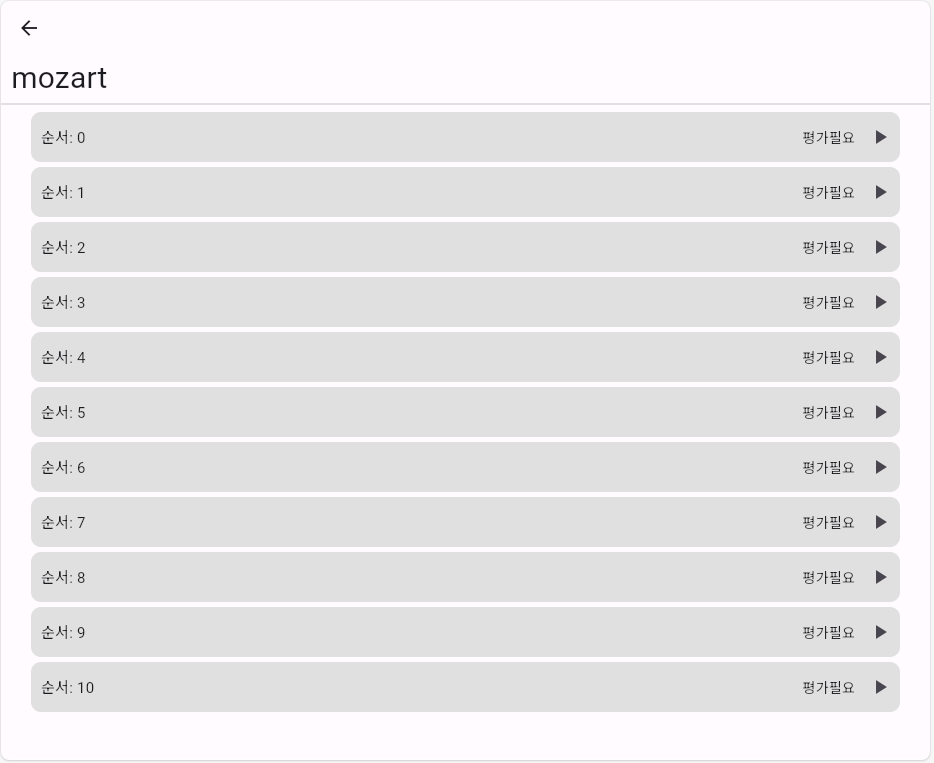
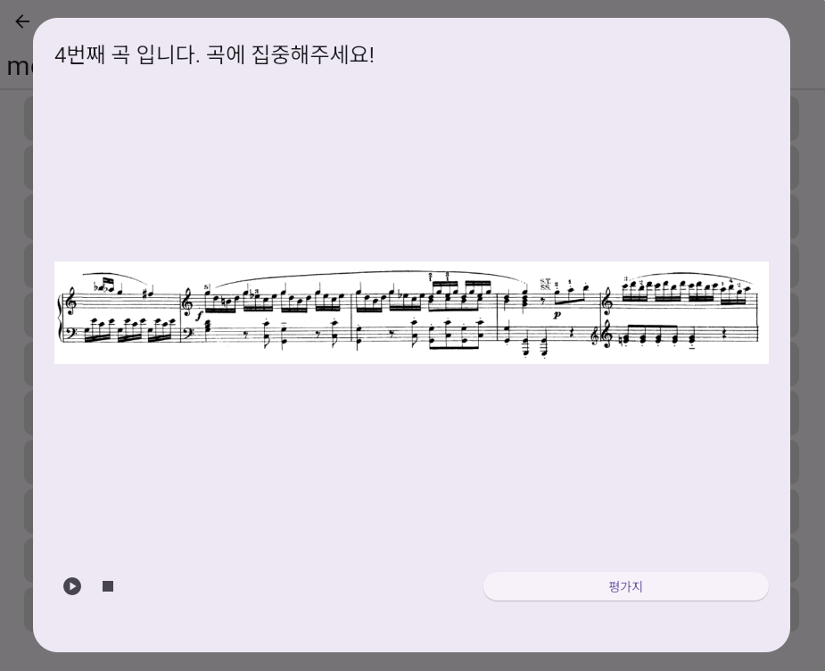
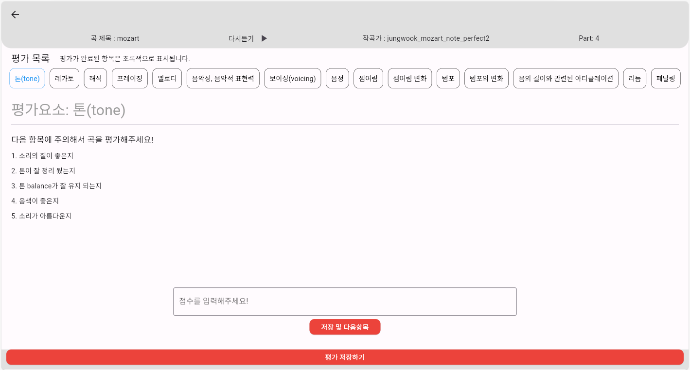
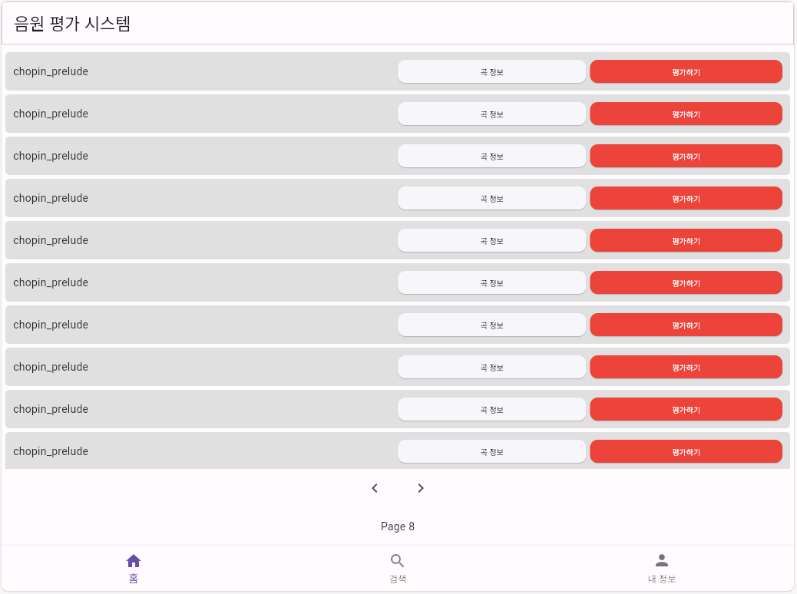
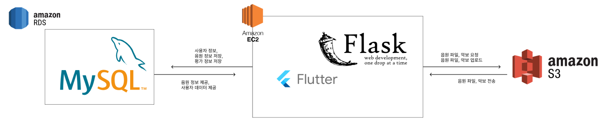

# [**피아노 데이터 평가 및 수집 프로그램**]

### 본 리포지토리는DGU DAlab의 피아노 데이터 평가 및 수집 프로그램 소스 코드 입니다.
---
---

## 기술 스택

- **Frontend**  
    

- **Backend**  
      

- **DevOps**  
      
---

## 서비스 소개

### [**기능 소개**]
- 본 서비스는 피아노 연주 데이터를 평가 받기 위해 업로드 및 관리
- 피아노 연주 데이터 재생 및 항목별 평가

---

## 주요 기능(상세)

- ### 메인 화면


 처음 접속하면 위와 같은 **로그인 / 회원가입 화면**이 나타납니다.
 
  | 단계 | 설명 |
  |------|------|
  | **아이디·비밀번호 입력** | 초기 화면에서 아이디와 비밀번호를 입력합니다. |
  | **시스템 로그인 클릭** | 자격이 올바르면 홈(곡 목록) 화면으로 자동 이동합니다. |
  | **오류 메시지** | 잘못된 정보일 경우 “아이디 또는 비밀번호가 올바르지 않습니다” 경고가 바로 표시됩니다. |


- ### 회원가입


  | 입력 항목 | 필수 | 규칙 · 설명 | 예외 / 오류 메시지 |
  |-----------|------|-------------|--------------------|
  | **아이디** | ● | 영문·숫자 **3 자 이상** | `중복확인` 버튼 → 이미 존재하면 “사용 불가” |
  | **비밀번호** | ● | 8 자 이상, **동일 문자·패턴이 3회 이상 반복되면 안 됨** (ex. `aaa`, `123123123`) | 규칙 위반 시 붉은 테두리 + 안내 문구 |
  | 이름 | ○ | 실명 또는 닉네임 | 빈 칸 허용 |
  | **전화번호** | ● | `010-xxxx-xxxx` 형식 | 형식이 다르면 경고 표시 |
  | 학과 | ○ | 전공 / 소속 | 빈 칸 허용 |
  | 대학교 | ○ | 재학·졸업 학교 | 빈 칸 허용 |
  | 직업 | ○ | 학생, 연구원 등 | 빈 칸 허용 |

  1. **아이디**·**비밀번호**·**전화번호** 세 항목은 반드시 입력해야 하며 규칙을 통과해야 합니다.  
  2. 나머지 항목은 입력하지 않아도 회원가입이 가능합니다.  
  3. 모든 조건을 만족하고 **회원가입** 버튼을 누르면 “회원가입이 완료되었습니다” 알림 후 로그인 화면으로 이동합니다.  
  4. 입력 오류가 있으면 해당 입력란 아래에 즉시 안내 문구가 표시되므로 수정 후 다시 시도하면 됩니다.


- ### 음악 검색


상단 검색창에 곡명을 입력하면 **실시간으로 일치·유사 결과**가 목록에 표시됩니다.

  | 사용 방법 | 화면 동작 |
  |-----------|-----------|
  | **검색어 입력** | ① 검색창에 키워드를 입력 → `Enter` 또는 우측 🔍 아이콘 클릭 |
  | **실시간 결과** | 입력할 때마다 서버가 곡명 LIKE 검색을 수행해 최대 20개까지 표시합니다. |
  | **목록 구성** | 동일 곡명이 여러 번 나올 수 있습니다.<br>· 이는 **연주자 / 연주 방법**(노트·다이내믹·페달 / perfect·bad 등) 이 다른 **별도 데이터**를 뜻합니다. |
  | **곡 선택** | 원하는 행을 탭하면 홈 화면과 동일하게 **곡 정보·세그먼트·평가 화면**으로 이동합니다. |

  #### 검색 예시
  | 입력 | 표시 결과 |
  |------|-----------|
  | `mozart` | mozart, mozart … *(여러 버전)* |
  | `chopin prelude` | chopin prelude<br>hyunsung chopin prelude note bad1 … |

  *검색은 대·소문자를 구분하지 않으며,*  
  입력된 **부분 문자열**(단, 공백 포함 위치·개수 동일) 이 들어간 모든 곡을 찾아 보여 줍니다.


- ### 10초 단위의 데이터 평가


  곡 행(또는 검색 결과)을 선택하면 위와 같이 **10 초 길이로 잘린 세그먼트 목록**이 표시됩니다.

  | UI 요소 | 동작 · 설명 | 백엔드 API 흐름 |
  |----------|------------|-----------------|
  | **순서 :n** | 세그먼트의 인덱스(0, 1, 2 …) | `/api/song/getSongPart?song_id=…` → `song_part` 테이블에서 `sequence` 값 순으로 정렬 |
  | **평가 필요 / 완료 버튼** | · 첫 방문 : “평가필요”<br>· 이미 평가함 : “완료” 표시로 바뀜 | `/api/review/getReviewDataByUserIdSongId` 로 현재 유저의 평가 여부 조회 |
  | **세그먼트 클릭** | 세그먼트가 10초 길이로 재생되며 **15개 평가 항목** 입력 화면으로 이동 | `/api/song/getSongScore` (악보) + `/api/review/saveReview` (평가 저장) |


- ### 곡 악보 표시 및 재생


  세그먼트를 선택하면 **미니 악보·오디오 플레이어·평가 버튼**이 포함된 팝업이 열립니다.

  | UI 요소 | 동작 · 설명 | 백엔드 API 흐름 |
  |----------|------------|-----------------|
  | 상단 안내 문구 | “N번째 곡입니다. 곡에 집중해주세요!” | 프런트에서 현재 인덱스를 표시 |
  | **악보 이미지** | 해당 세그먼트에 대응하는 **단일 이미지**를 불러와 표시 | `/api/song/getSongScore` → `song_score` 테이블의 `url` 필드 |
  | ▶ 재생 / ■ 정지 버튼 | 10초 오디오 재생 & 정지 | 세그먼트 mp3 직접 스트리밍 (`/data/piano_data/.../segment_n.mp3`) |
  | **평가지** 버튼 | 클릭 시 15개 평가 항목 입력 화면으로 전환 | 내부 라우트 이동(`<SegmentEvaluationPage>`) |

  > 악보와 오디오를 함께 보며 연주를 듣고, 바로 다음 단계에서 세밀한 평가를 입력할 수 있습니다.


- ### 15가지 항목을 기준으로 평가 지원


  세그먼트별로 아래 15개 항목에 1 ~ 10 점수를 매기고, 코멘트를 남길 수 있습니다.

  1. 톤(tone)  
  2. 레가토(legato)  
  3. 해석(representation)  
  4. 프레이징(phrasing)  
  5. 멜로디(melody)  
  6. 음악성·표현력(musicality)  
  7. 보이싱(voicing)  
  8. 음정(note)  
  9. 셈여림(dynamic)  
  10. 셈여림 변화(dynamic change)  
  11. 템포(tempo)  
  12. 템포 변화(tempo change)  
  13. 음 길이 / 아티큘레이션(articulation)  
  14. 리듬(rhythm)  
  15. 페달링(pedal)

  | 완료 조건 | 처리 |
  |-----------|------|
  | 15개 항목 모두 입력 후 **저장** | `/api/review/saveReview` → `review` 테이블에 즉시 저장 |
  | 세그먼트 평가 완료 | 세그먼트 리스트의 버튼이 **완료** 로 변경 |
  | 곡 내 모든 세그먼트 평가 완료 | 홈·검색 목록에서 해당 곡 행이 **완료 표시** 로 갱신 |

  평가 데이터는 연구·모델 학습에 사용될 라벨로 그대로 활용됩니다. 한 번 저장된 점수와 코멘트는 작성자 본인만 다시 수정할 수 있습니다.


- 연주자 익명 평가 시스템


  평가자가 보는 화면에는 **연주자 이름·연주 방식(perfect/bad 등)** 을 모두 숨기고,  
  오직 *곡명* 과 *세그먼트 순서* 만 표시됩니다.

  | 설계 의도 | 구현 방식 |
  |-----------|-----------|
  | **공정성 확보** | 평가자가 연주자를 인지하지 못하도록 메타데이터 노출 최소화 |
  | **식별 정보 제거** | 서버에서 곡 리스트를 내려줄 때 `song_name` 을 <br>순수 곡명으로 가공 (예: `hyunsung_chopin_note_bad1` → `chopin_prelu​de`) |
  | **세그먼트 식별** | “순서 : n” 번호만 노출 → 실제 mp3 경로는 백엔드에서 리턴하지만 UI 에서 가려짐 |
  | **평가 결과 저장** | `/api/review/saveReview` 호출 시 **user_id, song_id, sequence** 로만 매핑<br>연주자·variant 정보는 DB 조인으로만 확인 가능 |

  > 이런 구조 덕분에 평가자는 **연주 품질**만 순수하게 판단하고,<br>
  > 관리자는 별도 통계 페이지에서 연주자·연주 방식별 결과를 안전하게 열람할 수 있습니다.

---

## 서비스 아키텍처



| 구성 요소 | 역할 | 주요 트래픽 흐름 |
|-----------|------|-----------------|
| **Amazon RDS – MySQL** | 사용자 계정, 곡·세그먼트 메타데이터, 15 항목 평가 결과를 저장하는 관계형 DB | <br>① EC2 ↔ RDS : 로그인, 회원가입, 곡·세그먼트·평가 정보 CRUD |
| **Amazon EC2 + Flask** | • REST API 서버<br>• Flutter Web 정적 파일 호스팅 | <br>② 사용자 브라우저 ↔ EC2 : API 호출, Flutter Web 자원 다운로드<br>③ EC2 ↔ S3 : 음원·악보 업로드, URL 생성 |
| **Flutter (Web)** | 사용자 UI (로그인·검색·평가 모듈) | 브라우저에서 실행, Flask API 호출로 데이터 주고받음 |
| **Amazon S3** | 세그먼트 mp3, 악보 이미지 저장 | 직·간접 스트리밍 URL 제공 (CloudFront 없이 S3 정적 URL 사용) |

**동작 요약**

1. 사용자가 로그인하면 EC2 의 Flask 서버가 RDS 에서 자격을 검증하고 JWT 토큰을 반환합니다.  
2. 홈 / 검색 화면에서 곡 리스트를 요청하면 Flask 가 RDS 의 `song`, `song_part` 테이블을 조회해 응답합니다.  
3. 세그먼트 재생·악보 조회 시 브라우저는 S3 URL 을 직접 스트리밍하고, 점수 저장은 Flask API(`/api/review/saveReview`) 로 전송되어 RDS `review` 테이블에 기록됩니다.  
4. 업로더(관리자)는 새로운 음원·악보를 EC2 → S3 로 올리고, 메타데이터를 RDS 에 삽입하여 즉시 서비스에 반영할 수 있습니다.

---


## 설치 및 실행 방법

1. 저장소 클론

```bash
git clone https://github.com/dalabdgw/Piano_Performance_Evaluation_Application.git
```

2. 프로젝트 디렉터리로 이동

```bash
cd Piano_Performance_Evaluation_Application
```

3. 파이썬 개발 환경 설정
```bash
python -m venv venv
pip install -r requirements.txt
```

4. 다트 개발 환경 설정
Flutter 개발 환경이 설정되어 있지 않다면, [Flutter 설치 가이드](https://dart-ko.dev/)를 참고하여 설치하세요.

```bash
flutter pub get
```

5. 파이썬 플라스크 서버 실행

```bash
python main.py
```


---

## CI/CD 구축 및 배포 방법(추가 예정)

aws ec2를 통한 배포 및 서비스 제공

빌드 오류를 낮추기 위해서 사용
```bash
flutter clean
```
빌드 오류를 낮추기 위해서 사용


```bash
flutter pub get
```
패키지 적용

```bash
flutter build
```
빌드 파일 생성


```bash
cd ./build/web
```

```bash
move web ./backend/templates
```


```bash
cd ./backend/templates
```

```bash
git --version
```
깃허브 버전 확인
- 실행이 안된다면 깃허브 설치 후 시도

```bash
git --version
```

```bash
git add .
```

혹은

```bash
git add 파일명.확장자
```

```bash
git commit -m "[docs] 배포 버전 업로드"
```
커밋 메시지 작성 시

'[작업 카테고리] 작업한 내용' 으로 작성


```bash
git remore -v
```
업스트림 확인 후

origin  https://github.com/dalabdgw/Piano_Performance_Evaluation_Application.git (fetch)
origin  https://github.com/dalabdgw/Piano_Performance_Evaluation_Application.git (push) 

으로 출력되는 경우

```bash
git push origin main
```
만약 업스트림이 다음이 아닌 경우

```bash
git remote add origin https://github.com/dalabdgw/Piano_Performance_Evaluation_Application.git
```
을 사용해서 업스트림 적용 후 업로드 진행

---

 - aws 보안 설명 및 서버 로그인 하는 방법

aws 콘솔 접속
 key.pem
키를 활용해서 윈도우 암호 획득

---
